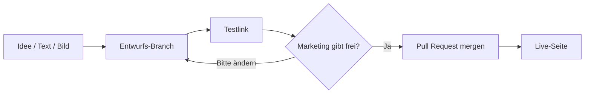

# Full Site Edit — so arbeiten wir

Diese Seite erklärt den Ablauf in Alltagssprache. Ziel: Marketing kann einen Entwurf **sehen und freigeben**, bevor Kundinnen und Kunden die Live-Seite sehen.

## In einem Satz

Wir bauen die Website in kleinen Entwürfen. Jeder Entwurf bekommt einen **Testlink**. Erst nach eurer Freigabe wird daraus die **Live-Seite**.

## Was bisher gebaut wurde

Eine schlanke React-Landingpage mit fünf Bausteinen:

1. **Hero** — großer Einstieg oben (Überschrift, Kurztext, Buttons, Kasten)
2. **Headline** — die Kernaussage darunter
3. **Bild + Text** — Inhalt nebeneinander
4. **FAQ** — aufklappbare Fragen
5. **Footer** — Abschlusszeile

Lokal im Browser prüfbar. Jede bestätigte Änderung soll als **Pull Request** (Freigabe-Anfrage) ins gemeinsame Archiv, nicht direkt auf die Live-Seite.

## Die drei Orte einer Seite

| Ort | Was ihr seht | Wer es sieht |
| --- | --- | --- |
| **Lokal** | Die Seite auf dem Rechner der Entwicklung | nur intern |
| **Testlink** | Eine eigene Web-Adresse für *diesen* Entwurf | Team, zum Zeigen und Freigeben |
| **Live** | Die öffentliche Website | alle Besucherinnen und Besucher |

Wichtig: Etwas nach GitHub zu legen heißt **nicht**, dass es live ist. GitHub ist nur das gemeinsame Archiv. Live wird erst, wenn ein Entwurf nach **main** übernommen wird.

## Der Weg vom Text zur Live-Seite

1. **Entwurf anlegen**  
   Ein Feature-Branch ist ein eigener Arbeitsstrang, z. B. `cursor/react-landing-page`. Die Live-Seite bleibt unberührt.

2. **Testlink teilen**  
   Sobald der Branch auf GitHub liegt, erzeugt Vercel automatisch eine Vorschau-URL. Die schickt ihr an Marketing, Fachbereich oder Kundschaft. Mehrere Entwürfe = mehrere Links, parallel.

3. **Freigabe**  
   Passt der Stand, wird der Pull Request bestätigt und nach `main` übernommen. `main` ist die Quelle der Live-Seite.

4. **Live**  
   Vercel baut daraus die Production-Seite. Ohne diesen Schritt ändert sich für Besucherinnen und Besucher nichts.

## Wer darf was entscheiden

| Rolle | Entscheidet |
| --- | --- |
| **Marketing / Fachbereich** | Texte, Bilder, Tonalität, „so darf es live“ |
| **Entwicklung** | Technik, Branches, Testlinks, Pull Requests |
| **Niemand allein** | Live-Gang ohne sichtbaren Testlink und Freigabe |

## Kurzes Wörterbuch

| Begriff | Bedeutung |
| --- | --- |
| **Branch / Entwurf** | Eine Variante der Seite, ohne die Live-Seite zu überschreiben |
| **main** | Der Stand, der live geht |
| **Pull Request (PR)** | Die Bitte: „Bitte diesen Entwurf prüfen und live nehmen“ |
| **Preview / Testlink** | Wegwerf-Adresse für genau diesen Entwurf |
| **Production / Live** | Die echte Website |
| **Commit** | Ein gespeicherter Zwischenstand im Archiv |
| **Merge** | Der Entwurf wird Teil von `main` und damit live |

## So teilt ihr einen Stand im Team

**Vor GitHub (nur intern am Rechner)**  
Bildschirm teilen oder, im selben WLAN, die lokale Adresse `http://localhost:5173`.

**Mit Testlink (empfohlen zum Freigeben)**  
Den Vercel-Preview-Link der Branch oder des Pull Requests schicken. Kein VPN, kein Installieren.

**Nicht verwenden zum Freigeben**  
Die Live-Domain. Die ändert sich erst nach Merge.

## Regeln, die Live-Unfälle verhindern

- Feature-Branches und Pull Requests erzeugen **nur Testlinks**.
- **Nur `main`** geht live.
- Texte und Bilder erst live, wenn Marketing den Testlink gesehen hat.
- Alte Testlinks dürfen verschwinden; Live bleibt, bis der nächste Freigabe-Stand kommt.

## Was ihr zum Freigeben braucht

Eine Mail oder ein Chat mit:

- Link zum **Pull Request** (Diskussion, Vergleich „vorher / nachher“)
- Link zum **Testlink** (die klickbare Seite)
- Kurzer Satz, was sich ändert (z. B. Headline, Hero-Text)

Antwortet mit **Freigabe**, **Änderung X** oder **nicht live nehmen**. Erst danach wird gemergt.
